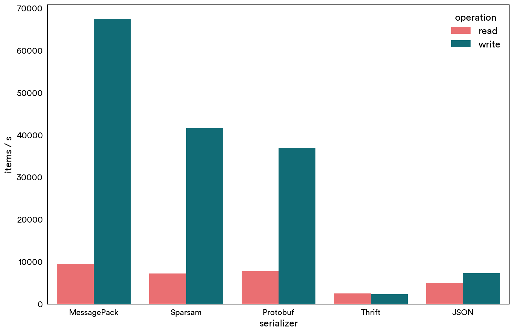

# Benchmark

The benchmark is run with `benchmark/ips` with the following struct definition. 
```thrift
struct Neighborhood {
  1: required i64 neighborhoodId,
  2: required string name,
}

struct ListingLocationUpdate {
  1: required i64 listingId,
  2: required double offsetLat,
  3: required double offsetLng,
  4: required i64 locationUpdateTimestamp,
  5: optional i64 cityId,
  6: optional i64 canonicalNeighborhoodId,
  7: optional list<Neighborhood> neighborhoods,
}
```

For each `ListingLocationUpdate`, 10 `Neighborhood`s are attached.

Here's the comparison of multiple serializers in ruby. Higher is better.


